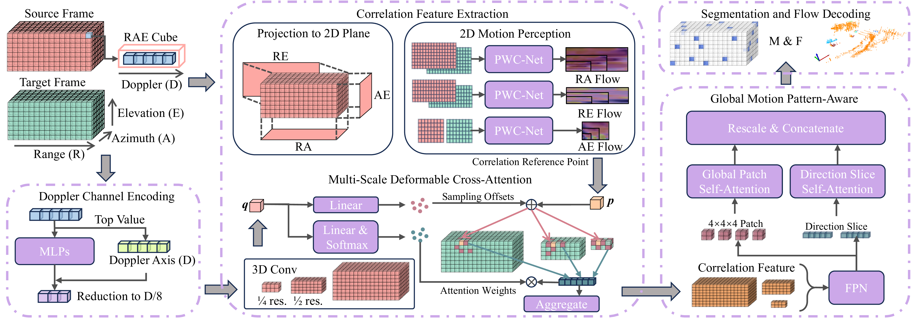

# <h1 align=center font-weight:100> [AAAI26]RadarMP: Motion Perception for 4D mmWave Radar in Autonomous Driving 
## Framework

## Dataset preprocessing
>Please follow the steps below to prepare and preprocess the dataset we used.
### 1. Obtain [K-Radar](https://github.com/kaist-avelab/K-Radar) dataset
### 2. Annotation Generation
RadarMP follow [CMFlow](https://github.com/Toytiny/CMFlow/blob/master/src/GETTING_STARTED.md) to generate scene flow labels using the os-2 64 lidar and gt odometry in the K-Radar dataset.
```bash
cd Toolkits
python annotation.py
cd ..
```
### 3. Data Volumn Reduction and Data Loading Acceleration
We truncate the first half of the range bins to focus on the key detection area of radar, and convert the data format from **.mat** to **.pt** to accelerate data loading.
```bash
cd Toolkits
python trans_tesseract_2_tensor.py
python trans_tesseract_2_ra_re_ae.py
cd ..
```
## Environment Installation
>Note: our code has been tested on Ubuntu 18.04 with Python 3.8/3.9, CUDA 11.8/12.4, PyTorch 2.1/2.4. It may work for other setups, but has not been tested.
### 1. Create Conda Environment
```bash
conda create --name radarmp python=3.8
conda activate radarmp
```
### 2. Install PyTorch with CUDA 
```bash
conda install pytorch==2.1.0 torchvision==0.16.0 torchaudio==2.1.0 pytorch-cuda=11.8 -c pytorch -c nvidia
```
### 3. Install Additional Requirements
```bash
chmod +x requirements.bash
./requirements.bash
```
### 4. Install correlation 2d library from [PWC-Net](https://github.com/NVlabs/PWC-Net) and 3d deformable attn ops from [VoxFormer](https://github.com/NVlabs/VoxFormer)
```bash
cd RadarMP/Lib/corr_2d/
python setup.py install
cd ../deform_attn_3d/
python setup.py build_ext --inplace
cd ../..
```
## Model Training
>Make sure you have successfully completed all above steps before you start running code for model training.

A pre-trained 2D energy flow estimation model must first be acquired for the RadarMP framework.
```bash
python train_flow2d.py
```
To train our RadarMP models, please run:
```bash
python train.py
```

## Model Evaluation
To evaluate the trained RadarMP models on the test set, please run:
```bash
python eval.py
```

## Performance


## Citation
If you find our paper and code useful for your research, please consider citing:

```bibtex
@inproceedings{cheng2025radarmp,
  title={RadarMP: Motion Perception for 4D mmWave Radar in Autonomous Driving},
  author={Ruiqi, Cheng and Huijun, Di and Jian, Li and Feng, Liu and Wei, Liang},
  booktitle={The Fortieth AAAI Conference on Artificial Intelligence (AAAI-26)},
  year={2026}
}
```
